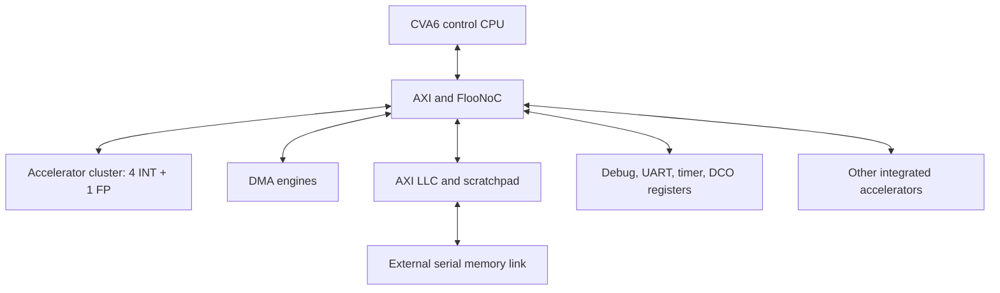

# Architecture and interfaces

## Scope

The sources integrate a CVA6 control CPU, FlooNoC interconnect, DMA engines,
an accelerator cluster, and system peripherals. `soc_id_i[1:0]` selects one
of four die address positions. The published tests exercise selected
subsystems. See the [RTL usage guide](../README.md) for supported build targets
and integration scope.

This diagram summarizes logical communication; it is not a cycle-level
interconnect diagram or proof of full-system operation.

## Accelerator cluster

[`int_fp_cluster.sv`](../core_cluster/int_fp_cluster.sv) instantiates four
INT cores and one FP core with per-core clock gating.
[`cluster_top.sv`](../core_cluster/cluster_top.sv) supplies the surrounding
interface adaptation. Each INT core contains an 8 x 8 signed 4-bit PE array,
four fixed tiles, a maximum accumulation depth of 32, an SF array, and a
SpAttn bucket/reduction datapath. PE and SF/SpAttn result transfers share DMA
arbitration. These defaults describe the included configuration, not an
exhaustively verified parameter space.

The FP core processes 256 groups of four MXINT16 operands per job. Each operand
is converted to BF16; a two-level addition tree combines the four values;
32-element blocks are quantized into packed 4-bit mantissas and an 8-bit scale.
Each job produces 256 mantissas and eight scales. The default
`PARALLEL_WIDTH` is 2. The regression covers 1, 2, 4, 8, 16, 32, and 64.

The FP `calc_result` path combines four sets of signed 32-bit operands and
evaluates `4*a + 8*b + 256*c + 512*d` using the existing 32-bit modular
arithmetic, then sign-extends the result. This is separate from the main
MX/BF16 pipeline.

FP results use the direct quantized output path. INT weights and activations
use direct memory-mapped writes.

## Local control interfaces

INT and FP cores expose pipelined 64-bit word interfaces, not raw AXI channels.
Neither interface has a byte-enable port. Sample responses on `mem_rvalid_o`
(INT) or `rvalid_o` (FP). Peripheral DCO registers instead use a register bus
with eight byte strobes after AXI conversion.

The following offsets are local to their block, not absolute SoC addresses:

| Block | Offset | Current behavior |
|---|---|---|
| INT | `0xF00` write | Start PE/SF/SpAttn at bits 0/1/2; `run_mode` at [9:8]; `col_idx` at [13:12] |
| INT | `0xF00` read | Three 16-bit cycle counts at [47:0]; completion flags [50:48]; `run_mode` [57:56]; `col_idx` [61:60] |
| INT | `0x800–0x8FF` | Reserved: reads `0xCA11AB1EBADCAB1E`, writes ignored |
| FP | `0xC00–0xC7F` | Packed mantissa outputs, read only |
| FP | `0xC80–0xC87` | Eight output scale factors, read only |
| FP | `0xCD0` | Quant mode bit 0, start bit 1, done bit 2, reserved bit 3, power mode bit 4 |

INT control bits [7:3] are reserved and ignored; status bits [55:51] read zero.
FP bit 3 is write-ignore/read-zero. Other controls retain their existing
semantics; in particular, FP done can be affected by software writes to its
CSR field. See the detailed
[INT specification](../int_core/spec/int_core_spec.md) and
[FP specification](../fp_core/spec/fpcore_spec.md).

## Address space and cache attributes

For die index `d`, the die offset is `d << 32`, as defined in
[`soc_pkg.sv`](../soc_pkg.sv). Selected die-local windows are:

| Region | Base before die offset | Decode window |
|---|---|---|
| Debug | `0x00000000` | 4 KiB |
| DCO registers | `0x20000000` | 4 KiB |
| Accelerator region | `0x30000000` | See SoC/NoC decode tables |
| SPM | `0x80000000` | 256 MiB address aperture |
| DRAM | `0x90000000` | 256 MiB address aperture |

An address aperture is not installed memory capacity. The current LLC
configuration contains 64 KiB of physical storage, with 32 KiB assigned to
SPM at reset. Access beyond the physical SPM routing range can go to the
external bypass path; it is not guaranteed to return an error when that
external endpoint is absent.

CVA6 cache bases pair `{SPMBase, DRAMBase}` with the corresponding
lengths. All four Debug windows are uncached and configured as non-idempotent,
which constrains speculative loads. These attributes serve different roles:
uncached loads avoid stale cache data, while non-idempotent handling prevents
an uncommitted load from being accepted as a side-effecting access.

## DCO control and observation

The DCO register block uses the low 12 address bits within its SoC window.
Offsets must be aligned and implemented; unsupported offsets report an error.

| Offset | Defined fields | Reset |
|---|---|---|
| `0x000` | Coarse control [5:0] | 63 |
| `0x008` | Fine control [5:0] | 63 |
| `0x010` | Test-divider selection [2:0] | 4 |
| `0x018` | System frequency selection [1:0] | 3 |
| `0x020` | INT [31:0], FP [39:32], SP [40], auxiliary slot [44] clock gating | 0 |

Writes update only bytes selected by `wstrb`; undefined bits read zero.
In external-clock mode, `FREQ_SEL` values 0/1/2/3 select division ratios
1/2/1/4 at `DCO.CLK`. `DIV_SEL` values 0 through 7 divide that clock further
by 1 through 128 at `DCO.CLK_DIV`. The SoC uses `CLK`; `CLK_DIV` is unconnected
at the SoC instance. Under `SIM`, both the internal clock and DCO observation
output follow `sys_clk_i`.

The divider tests use the actual DCO structural source with ideal functional
cells and the oscillator disabled. They do not predict ring frequency,
coarse/fine tuning curves, jitter, or safe live switching of clock controls.
